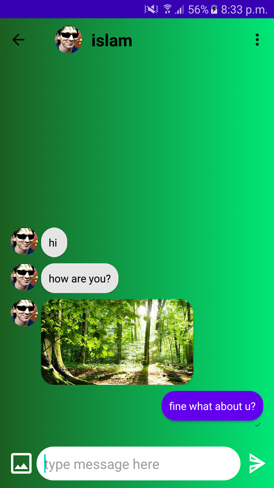

# Chat App

Chatting android application developed using **Java** & **Google Firebase** & **one signal**

---

# Getting Started
### Libraries Used
- **Firebase**
- **Glide**
- **Ucrop**
- **OneSignal**

---

# Project Features

- **Firebase Authentication** to allow users to register/login into application.
- **Firebase Realtime Database** to allow live-chatting and automatically update chats
- **Firebase Storage** to save user's profile pictures & chat images.
- **OneSignal push notifications** to send new messages and friend requests notifications.
- Allow each user to have **add/remove/block** friends.
- Add delivered/seen mark to provide.
- Add sending images support.
- Add Last Message support.
- Add Delete chat support.
- Add change the chat color theme to 4 differnet themes.
- Add splash screen.

---

# Screenshots

